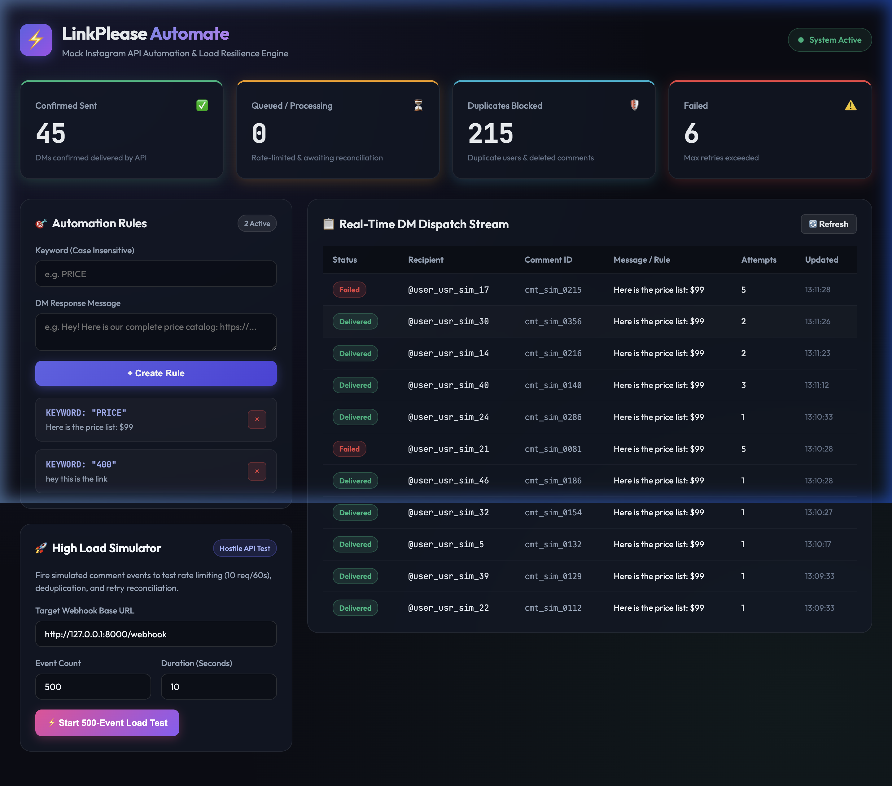

# LinkPlease — Instagram Automation & Hostile API Resilience Engine

[](https://python.org)
[](https://fastapi.tiangolo.com)
[](https://sqlite.org)
[](#)

LinkPlease automates Instagram DMs for creators. When someone comments a keyword (e.g. `PRICE`) on a creator's post, the system automatically matches the rule and sends a direct message to the commenter — built on top of a hostile mock Instagram API with strict rate limiting, random server failures, duplicate event delivery, and asynchronous status transitions.

---

## 🖼️ Application Preview



---

## ✨ Core Features

### 🎯 Part A — Core Engine & Deduplication
- **Rule Matching Engine**: Case-insensitive keyword matching anywhere in incoming comment text.
- **Strict User Deduplication**: Guarantees that a user (`user_id`) receives at most **one DM per rule**, regardless of how many times they comment.
- **Fast Non-Blocking Webhooks**: Webhooks return `200 OK` within **< 10ms**, queueing work in a background SQLite Write-Ahead Logging (WAL) queue.

### 🛡️ Part B — Webhook Security & Telemetry
- **HMAC-SHA256 Signature Verification**: Verifies `X-PseudoGram-Signature` headers using HMAC-SHA256 to reject forged requests.
- **Real-Time `/stats` Endpoint**: Reports live numbers for `sent`, `failed`, `queued`, and `duplicates_blocked`.

### ⚡ Part C — Reconciliation & Load Resilience
- **Sliding-Window Rate Limiter**: Enforces a strict max limit of **10 requests per rolling 60 seconds** (`X-API-Key`) for `POST /v1/dm/send`.
- **Asynchronous Status Reconciliation**: Background worker polls `GET /v1/dm/{dm_id}` (which doesn't count against rate limits) to detect failed deliveries (~15% mock server drop rate) and re-enqueues them for retry.
- **`comment.deleted` Event Handling**: Automatically cancels pending queued DMs if the original comment is deleted before dispatch.
- **Hostile Error Handling**: Retries remote `500` server errors with exponential backoff and respects `Retry-After` on `429` rate limits.

---

## 🛠️ Tech Stack & Architecture

- **Backend**: Python 3.10+, FastAPI, Uvicorn, Asyncio
- **Database**: SQLite3 configured with Write-Ahead Logging (`PRAGMA journal_mode=WAL`)
- **HTTP Client**: `httpx` (async)
- **Frontend**: HTML5, Vanilla JavaScript, CSS3 (Dark Glassmorphism UI)

---

## 📋 Non-Negotiable API Contracts

### 1. `POST /webhook`
Receives comment webhooks. Returns `200 OK` instantly.
```json
// Headers: X-PseudoGram-Signature: sha256=<hex>
{
  "event_id": "evt_01J8ZQ4K2N7RXA",
  "event_type": "comment.created",
  "sent_at": "2026-08-10T09:14:22.481Z",
  "data": {
    "comment_id": "cmt_9f2a7c",
    "post_id": "post_44de1b",
    "text": "PRICE please 🙏",
    "created_at": "2026-08-10T09:14:21.900Z",
    "from": {
      "user_id": "usr_3b91fe",
      "username": "arjun.shoots"
    }
  }
}
```

### 2. `POST /rules`
Creates a keyword automation rule. Returns `201 Created`.
```json
// Request
{ "keyword": "PRICE", "dm_message": "Here's the price list: https://..." }

// Response 201
{ "rule_id": "rule_04a23f978756", "keyword": "PRICE", "dm_message": "Here's the price list: https://..." }
```

### 3. `GET /stats`
Reports live system telemetry.
```json
{
  "sent": 142,
  "failed": 3,
  "queued": 8,
  "duplicates_blocked": 57
}
```

---

## 📦 Prerequisites & Installation

### Prerequisites
- Python 3.10 or higher
- `pip` package manager

### Setup

1. **Clone the repository**:
   ```bash
   git clone https://github.com/your-username/linkplease.git
   cd linkplease
   ```

2. **Create and activate a virtual environment**:
   ```bash
   python3 -m venv venv
   source venv/bin/activate  # On Windows: venv\Scripts\activate
   ```

3. **Install dependencies**:
   ```bash
   pip install -r requirements.txt
   ```

---

## 🚀 Running Locally

### 1. Start the Application Server
```bash
./venv/bin/uvicorn main:app --host 127.0.0.1 --port 8000
```
Access the interactive dashboard in your browser: **`http://127.0.0.1:8000`**

### 2. Run Automated Contract Tests
Verify all API contracts, signature verifications, and deduplication rules:
```bash
./venv/bin/python test_suite.py
```

### 3. Execute 500-Event Load Simulation
Fires 500 comment events over 10 seconds to test rate limiting, deduplication, and reconciliation under load:
```bash
./venv/bin/python local_simulator.py
```

---

## 📄 Failure & Edge Case Documentation

For a detailed technical breakdown of system edge cases, network partition handling, and memory vs disk trade-offs, see [FAILURES.md](FAILURES.md).# instagramcomments-
